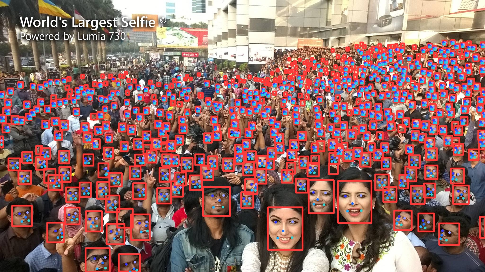

# WIDER-FACE Face Detector Based On YOLOV8

BiliBili-Video:[深度学习改进实验必看！基于YOLOV8的WIDER-FACE改进(轻量化+提点)实验思路讲解](https://www.bilibili.com/video/BV1QJ4m1H7DJ/)

### Environment

    1. conda create -n pytorch_2_1_0_py39 python=3.9 anaconda
    2. pip install torch==2.1.0 torchvision==0.16.0 --index-url https://download.pytorch.org/whl/cu121
    3. pip install -i https://pypi.tuna.tsinghua.edu.cn/simple timm==0.9.16 thop efficientnet_pytorch==0.7.1 einops albumentations==1.4.0 Cython
    4. cd widerface_evaluate && python setup.py build install

### DataSet Downloads Link

[BaiDu Cloud](https://pan.baidu.com/s/1VOR_vAtGpyKECt9u_m16Sw?pwd=hw9w)

### Contrast Experiment

| model | Parameters(M) | GFLOPs | Easy Val AP | Medium Val AP | Hard Val AP |
| :----: | :----: | :----: | :----: | :----: | :----: |
| Ours | 0.503 | 5.0 | 0.937 | 0.922 | 0.809 |
| Yolov5n-0.5 | 0.447 | 0.571 | 0.908 | 0.881 | 0.738 |
| Yolov5n | 1.726 | 2.111 | 0.936 | 0.915 | 0.805 |
| Yolov7-tiny | - | 13.2 | 0.947 | 0.926 | 0.821 |
| SCRFD-10GF | 1.62 | 2.57 | 0.952 | 0.939 | 0.831 |
| SCRFD-2.5GF | 0.67 | 2.53 | 0.938 | 0.922 | 0.785 |
| yolov8n-pose(baseline) | 3.08 | 8.3 | 0.944 | 0.919 | 0.775 |

| model | Parameters | GFLOPs | Model Size | Easy Val AP | Medium Val AP | Hard Val AP | Inference Time(bs:32) |
| :----: | :----: | :----: | :----: | :----: | :----: | :----: | :----: |
| yolov8n-pose no-pretrain | 3,078,128 | 8.3 | 6.4m | 0.936 | 0.912 | 0.776 | 0.00086s |
| filter 5 pixel lowprecision object in 640 images-size | 3,078,128 | 8.3 | 6.4m | 0.938 | 0.917 | 0.779 | 0.00086s |
| filter 5 pixel lowprecision object in 640 images-size + topk=3 | 3,078,128 | 8.3 | 6.4m | 0.931 | 0.915 | 0.787 | 0.00086s |
| filter 5 pixel lowprecision object in 640 images-size + topk=3 | 3,078,128 | 8.3 | 6.4m | 0.931 | 0.915 | 0.787 | 0.00086s |
| filter 5 pixel lowprecision object in 640 images-size + topk=3 + P6 | 4,878,288 | 8.3 | 9.6m | 0.935 | 0.919 | 0.789 | 0.00086s |
| filter 5 pixel lowprecision object in 640 images-size + topk=3 + P6 + HGStem | 4,899,840 | 10.1 | 9.7m | 0.941 | 0.928 | 0.810 | 0.00136s |
| filter 5 pixel lowprecision object in 640 images-size + topk=3 + P6 + HGStem + LSCD | 3,887,489 | 8.4 | 7.7m | 0.942 | 0.928 | 0.807 | 0.00130s |
| filter 5 pixel lowprecision object in 640 images-size + topk=3 + P6 + HGStem + LSCD + BIFPN | 2,386,962 | 7.6 | 4.9m | 0.942 | 0.929 | 0.811 | 0.00135s |
| filter 5 pixel lowprecision object in 640 images-size + topk=3 + P6 + HGStem + LSCD + BIFPN + Rep | 2,386,962 | 7.6 | 4.9m | 0.943 | 0.929 | 0.814 | 0.00135s |
| filter 5 pixel lowprecision object in 640 images-size + topk=3 + P6 + HGStem + LSCD + BIFPN + Rep + LMAP 1.5X | 503,686 | 5.0 | 1.3m | 0.937 | 0.922 | 0.809 | 0.00111s |

### Test Image (image-size:1280,conf:0.25,max_det:1000)

### Experimental Result BaseLine:yolov8n-pose

#### yolov8n-pose
| model | Parameters | GFLOPs | Model Size | Easy Val AP | Medium Val AP | Hard Val AP | Inference Time(bs:32) |
| :----: | :----: | :----: | :----: | :----: | :----: | :----: | :----: |
| yolov8n-pose | 3,078,128 | 8.3 | 6.4m | 0.944 | 0.919 | 0.775 | 0.00086s |
| yolov8n-pose no-pretrain | 3,078,128 | 8.3 | 6.4m | 0.936 | 0.912 | 0.776 | 0.00086s |

#### (yolov8n-pose no-pretrain) filter x pixel lowprecision object in 640 images-size
| model | Parameters | GFLOPs | Model Size | Easy Val AP | Medium Val AP | Hard Val AP | Inference Time(bs:32) |
| :----: | :----: | :----: | :----: | :----: | :----: | :----: | :----: |
| yolov8n-pose | 3,078,128 | 8.3 | 6.4m | 0.936 | 0.912 | 0.776 | 0.00086s |
| filter 9 pixel lowprecision object in 640 images-size | 3,078,128 | 8.3 | 6.4m | 0.943 | 0.922 | 0.758 | 0.00086s |
| filter 7 pixel lowprecision object in 640 images-size | 3,078,128 | 8.3 | 6.4m | 0.941 | 0.918 | 0.768 | 0.00086s |
| filter 6 pixel lowprecision object in 640 images-size | 3,078,128 | 8.3 | 6.4m | 0.939 | 0.918 | 0.774 | 0.00086s |
| filter 5 pixel lowprecision object in 640 images-size | 3,078,128 | 8.3 | 6.4m | 0.938 | 0.917 | 0.779 | 0.00086s |
| filter 4 pixel lowprecision object in 640 images-size | 3,078,128 | 8.3 | 6.4m | 0.934 | 0.911 | 0.775 | 0.00086s |

#### (yolov8n-pose no-pretrain filter 5 pixel lowprecision object in 640 images-size) + FaceRandomCrop
| model | Parameters | GFLOPs | Model Size | Easy Val AP | Medium Val AP | Hard Val AP | Inference Time(bs:32) |
| :----: | :----: | :----: | :----: | :----: | :----: | :----: | :----: |
| baseline | 3,078,128 | 8.3 | 6.4m | 0.938 | 0.917 | 0.779 | 0.00086s |
| FaceRandomCrop(max_crop_ratio=0.5, p=0.2) | 3,078,128 | 8.3 | 6.4m | 0.934 | 0.909 | 0.764 | 0.00086s |
| FaceRandomCrop(max_crop_ratio=0.2, p=0.5) | 3,078,128 | 8.3 | 6.4m | 0.929 | 0.902 | 0.741 | 0.00086s |
| FaceRandomCrop(max_crop_ratio=0.2, p=0.2) | 3,078,128 | 8.3 | 6.4m | 0.933 | 0.909 | 0.766 | 0.00086s |
| FaceRandomCrop(max_crop_ratio=0.1, p=0.2) | 3,078,128 | 8.3 | 6.4m | 0.935 | 0.910 | 0.767 | 0.00086s |
| FaceRandomCrop(max_crop_ratio=0.1, p=0.1) | 3,078,128 | 8.3 | 6.4m | 0.936 | 0.915 | 0.773 | 0.00086s |

#### (yolov8n-pose no-pretrain filter 5 pixel lowprecision object in 640 images-size) + TAL
| model | Parameters | GFLOPs | Model Size | Easy Val AP | Medium Val AP | Hard Val AP | Inference Time(bs:32) |
| :----: | :----: | :----: | :----: | :----: | :----: | :----: | :----: |
| baseline | 3,078,128 | 8.3 | 6.4m | 0.938 | 0.917 | 0.779 | 0.00086s |
| topk=7 | 3,078,128 | 8.3 | 6.4m | 0.934 | 0.915 | 0.782 | 0.00086s |
| topk=5 | 3,078,128 | 8.3 | 6.4m | 0.935 | 0.917 | 0.787 | 0.00086s |
| topk=3 | 3,078,128 | 8.3 | 6.4m | 0.931 | 0.915 | 0.787 | 0.00086s |
| topk=3 beta=9.0 | 3,078,128 | 8.3 | 6.4m | 0.926 | 0.907 | 0.789 | 0.00086s |

#### (yolov8n-pose no-pretrain filter 5 pixel lowprecision object in 640 images-size + TAL) + SPPF-3
| model | Parameters | GFLOPs | Model Size | Easy Val AP | Medium Val AP | Hard Val AP | Inference Time(bs:32) |
| :----: | :----: | :----: | :----: | :----: | :----: | :----: | :----: |
| baseline | 3,078,128 | 8.3 | 6.4m | 0.931 | 0.915 | 0.787 | 0.00086s |
| SPPF-3 | 3,078,128 | 8.3 | 6.4m | 0.932 | 0.915 | 0.787 | 0.00086s |

#### (yolov8n-pose no-pretrain filter 5 pixel lowprecision object in 640 images-size + TAL) + P6
| model | Parameters | GFLOPs | Model Size | Easy Val AP | Medium Val AP | Hard Val AP | Inference Time(bs:32) |
| :----: | :----: | :----: | :----: | :----: | :----: | :----: | :----: |
| baseline | 3,078,128 | 8.3 | 6.4m | 0.931 | 0.915 | 0.787 | 0.00086s |
| P6 | 4,878,288 | 8.3 | 9.6m | 0.935 | 0.919 | 0.789 | 0.00086s |

#### (yolov8n-pose no-pretrain filter 5 pixel lowprecision object in 640 images-size + TAL) + P6-C2f
| model | Parameters | GFLOPs | Model Size | Easy Val AP | Medium Val AP | Hard Val AP | Inference Time(bs:32) |
| :----: | :----: | :----: | :----: | :----: | :----: | :----: | :----: |
| baseline | 3,078,128 | 8.3 | 6.4m | 0.931 | 0.915 | 0.787 | 0.00086s |
| P6-C2f | 4,863,828 | 8.2 | 9.6m | 0.933 | 0.916 | 0.786 | 0.00083s |

#### (yolov8n-pose no-pretrain filter 5 pixel lowprecision object in 640 images-size + TAL + P6) + ADown
| model | Parameters | GFLOPs | Model Size | Easy Val AP | Medium Val AP | Hard Val AP | Inference Time(bs:32) |
| :----: | :----: | :----: | :----: | :----: | :----: | :----: | :----: |
| baseline | 4,878,288 | 8.3 | 9.6m | 0.935 | 0.919 | 0.789 | 0.00086s |
| ADown | 4,874,960 | 8.1 | 9.6m | 0.934 | 0.915 | 0.770 | 0.00093s |

#### (yolov8n-pose no-pretrain filter 5 pixel lowprecision object in 640 images-size + TAL + P6) + V7Down
| model | Parameters | GFLOPs | Model Size | Easy Val AP | Medium Val AP | Hard Val AP | Inference Time(bs:32) |
| :----: | :----: | :----: | :----: | :----: | :----: | :----: | :----: |
| baseline | 4,878,288 | 8.3 | 9.6m | 0.935 | 0.919 | 0.789 | 0.00086s |
| V7Down | 4,876,512 | 8.3 | 9.6m | 0.935 | 0.918 | 0.789 | 0.00094s |

#### (yolov8n-pose no-pretrain filter 5 pixel lowprecision object in 640 images-size + TAL + P6) + HGStem
| model | Parameters | GFLOPs | Model Size | Easy Val AP | Medium Val AP | Hard Val AP | Inference Time(bs:32) |
| :----: | :----: | :----: | :----: | :----: | :----: | :----: | :----: |
| baseline | 4,878,288 | 8.3 | 9.6m | 0.935 | 0.919 | 0.789 | 0.00086s |
| HGStem | 4,899,840 | 10.1 | 9.7m | 0.941 | 0.928 | 0.810 | 0.00136s |

#### (yolov8n-pose no-pretrain filter 5 pixel lowprecision object in 640 images-size + TAL + P6) + LSCD
| model | Parameters | GFLOPs | Model Size | Easy Val AP | Medium Val AP | Hard Val AP | Inference Time(bs:32) |
| :----: | :----: | :----: | :----: | :----: | :----: | :----: | :----: |
| baseline | 4,878,288 | 8.3 | 9.6m | 0.935 | 0.919 | 0.789 | 0.00086s |
| LSCD | 3,865,937 | 6.6 | 7.7m | 0.937 | 0.920 | 0.789 | 0.00080s |

#### (yolov8n-pose no-pretrain filter 5 pixel lowprecision object in 640 images-size + TAL + P6 + HGStem) + LSCD
| model | Parameters | GFLOPs | Model Size | Easy Val AP | Medium Val AP | Hard Val AP | Inference Time(bs:32) |
| :----: | :----: | :----: | :----: | :----: | :----: | :----: | :----: |
| baseline | 4,899,840 | 10.1 | 9.7m | 0.941 | 0.928 | 0.810 | 0.00136s |
| LSCD | 3,887,489 | 8.4 | 7.7m | 0.942 | 0.928 | 0.807 | 0.00130s |

#### (yolov8n-pose no-pretrain filter 5 pixel lowprecision object in 640 images-size + TAL + P6 + HGStem + LSCD) + BIFPN
| model | Parameters | GFLOPs | Model Size | Easy Val AP | Medium Val AP | Hard Val AP | Inference Time(bs:32) |
| :----: | :----: | :----: | :----: | :----: | :----: | :----: | :----: |
| baseline | 3,887,489 | 8.4 | 7.7m | 0.942 | 0.928 | 0.807 | 0.00130s |
| BIFPN | 2,386,962 | 7.6 | 4.9m | 0.942 | 0.929 | 0.811 | 0.00135s |

#### (yolov8n-pose no-pretrain filter 5 pixel lowprecision object in 640 images-size + TAL + P6 + HGStem + LSCD + BIFPN) + Rep
| model | Parameters | GFLOPs | Model Size | Easy Val AP | Medium Val AP | Hard Val AP | Inference Time(bs:32) |
| :----: | :----: | :----: | :----: | :----: | :----: | :----: | :----: |
| baseline | 2,386,962 | 7.6 | 4.9m | 0.942 | 0.929 | 0.811 | 0.00135s |
| Rep1 | 2,386,962 | 7.6 | 4.9m | 0.943 | 0.929 | 0.814 | 0.00135s |
| Rep2 | 2,386,962 | 7.6 | 4.9m | 0.941 | 0.925 | 0.812 | 0.00135s |
| Rep3 | 2,386,962 | 7.6 | 4.9m | 0.940 | 0.926 | 0.814 | 0.00135s |
| Rep4 | 2,386,962 | 7.6 | 4.9m | 0.941 | 0.927 | 0.813 | 0.00135s |

#### (yolov8n-pose no-pretrain filter 5 pixel lowprecision object in 640 images-size + TAL + P6 + HGStem + LSCD + BIFPN + Rep) + C2f-XXX
| model | Parameters | GFLOPs | Model Size | Easy Val AP | Medium Val AP | Hard Val AP | Inference Time(bs:32) |
| :----: | :----: | :----: | :----: | :----: | :----: | :----: | :----: |
| baseline | 2,386,962 | 7.6 | 4.9m | 0.943 | 0.929 | 0.814 | 0.00135s |
| EMBC | 2,623,842 | 7.1 | 5.4m | 0.940 | 0.926 | 0.813 | 0.00156s |
| Faster | 1,901,922 | 6.6 | 4.0m | 0.935 | 0.922 | 0.808 | 0.00132s |
| DWR | 2,303,010 | 7.6 | 4.8m | 0.939 | 0.924 | 0.813 | 0.00137s |
| RVB | 1,886,370 | 6.6 | 4.0m | 0.938 | 0.924 | 0.808 | 0.00136s |

#### (yolov8n-pose no-pretrain filter 5 pixel lowprecision object in 640 images-size + TAL + P6 + HGStem + LSCD + BIFPN + Rep) + SlideLoss
| model | Parameters | GFLOPs | Model Size | Easy Val AP | Medium Val AP | Hard Val AP | Inference Time(bs:32) |
| :----: | :----: | :----: | :----: | :----: | :----: | :----: | :----: |
| baseline | 2,386,962 | 7.6 | 4.9m | 0.943 | 0.929 | 0.814 | 0.00135s |
| SlideLoss | 2,386,962 | 7.6 | 4.9m | 0.942 | 0.928 | 0.814 | 0.00135s |

#### (yolov8n-pose no-pretrain filter 5 pixel lowprecision object in 640 images-size + TAL + P6 + HGStem + LSCD + BIFPN + Rep) + NWD
| model | Parameters | GFLOPs | Model Size | Easy Val AP | Medium Val AP | Hard Val AP | Inference Time(bs:32) |
| :----: | :----: | :----: | :----: | :----: | :----: | :----: | :----: |
| baseline | 2,386,962 | 7.6 | 4.9m | 0.943 | 0.929 | 0.814 | 0.00135s |
| iou:0.5 nwd:0.5 c:1 | 2,386,962 | 7.6 | 4.9m | 0.940 | 0.925 | 0.810 | 0.00135s |
| iou:0.7 nwd:0.3 c:1 | 2,386,962 | 7.6 | 4.9m | 0.941 | 0.925 | 0.811 | 0.00135s |
| iou:0.5 nwd:0.5 c:24.4 | 2,386,962 | 7.6 | 4.9m | 0.942 | 0.929 | 0.813 | 0.00135s |
| iou:0.7 nwd:0.3 c:24.4 | 2,386,962 | 7.6 | 4.9m | 0.941 | 0.927 | 0.813 | 0.00135s |

#### (yolov8n-pose no-pretrain filter 5 pixel lowprecision object in 640 images-size + TAL + P6 + HGStem + LSCD + BIFPN + Rep) + Inner-CIoU
| model | Parameters | GFLOPs | Model Size | Easy Val AP | Medium Val AP | Hard Val AP | Inference Time(bs:32) |
| :----: | :----: | :----: | :----: | :----: | :----: | :----: | :----: |
| baseline | 2,386,962 | 7.6 | 4.9m | 0.943 | 0.929 | 0.814 | 0.00135s |
| ratio=1.1 | 2,386,962 | 7.6 | 4.9m | 0.934 | 0.923 | 0.810 | 0.00135s |
| ratio=1.2 | 2,386,962 | 7.6 | 4.9m | 0.942 | 0.927 | 0.815 | 0.00135s |
| ratio=1.25 | 2,386,962 | 7.6 | 4.9m | 0.940 | 0.926 | 0.811 | 0.00135s |
| ratio=1.3 | 2,386,962 | 7.6 | 4.9m | 0.942 | 0.928 | 0.814 | 0.00135s |
| ratio=1.4 | 2,386,962 | 7.6 | 4.9m | 0.941 | 0.926 | 0.813 | 0.00135s |

#### (yolov8n-pose no-pretrain filter 5 pixel lowprecision object in 640 images-size + TAL + P6 + HGStem + LSCD + BIFPN + Rep) + XIoU
| model | Parameters | GFLOPs | Model Size | Easy Val AP | Medium Val AP | Hard Val AP | Inference Time(bs:32) |
| :----: | :----: | :----: | :----: | :----: | :----: | :----: | :----: |
| baseline | 2,386,962 | 7.6 | 4.9m | 0.943 | 0.929 | 0.814 | 0.00135s |
| EIoU | 2,386,962 | 7.6 | 4.9m | 0.939 | 0.925 | 0.814 | 0.00135s |
| DIoU | 2,386,962 | 7.6 | 4.9m | 0.941 | 0.926 | 0.813 | 0.00135s |
| SIoU | 2,386,962 | 7.6 | 4.9m | 0.935 | 0.923 | 0.814 | 0.00135s |
| MODIoU | 2,386,962 | 7.6 | 4.9m | 0.940 | 0.927 | 0.813 | 0.00135s |

#### (yolov8n-pose no-pretrain filter 5 pixel lowprecision object in 640 images-size + TAL + P6 + HGStem + LSCD + BIFPN + Rep) + LAMP
| model | Parameters | GFLOPs | Model Size | Easy Val AP | Medium Val AP | Hard Val AP | Inference Time(bs:32) |
| :----: | :----: | :----: | :----: | :----: | :----: | :----: | :----: |
| baseline | 2,386,962 | 7.6 | 4.9m | 0.943 | 0.929 | 0.814 | 0.00135s |
| LMAP 1.5X | 503,686 | 5.0 | 1.3m | 0.937 | 0.922 | 0.809 | 0.00111s |
| LMAP 2.0X | 321,762 | 3.7 | 1.0m | 0.919 | 0.907 | 0.792 | 0.00090s |
| LMAP 2.5X | 229,801 | 2.9 | 0.8m | 0.904 | 0.892 | 0.774 | 0.00077s |

# Reference
1. https://github.com/deepinsight/insightface/tree/master/detection/scrfd
2. https://github.com/deepcam-cn/yolov5-face
3. https://github.com/derronqi/yolov7-face
4. https://github.com/derronqi/yolov8-face 
5. https://github.com/Krasjet-Yu/YOLO-FaceV2